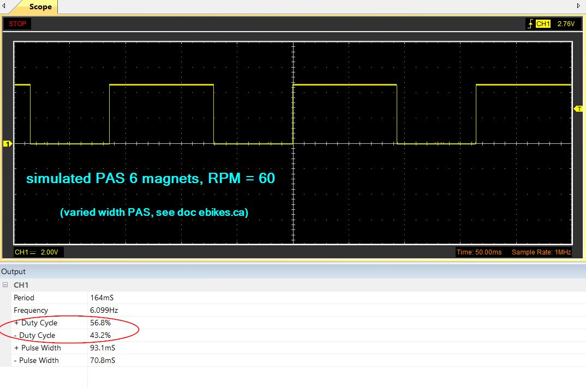

# e-bike throttle to PAS converter
Arduino e-bike throttle to PAS simulation and replication \
Using a throttle (thumb throttle or accelerator) to simulate pedaling on an e-bike

Utilisation d'un throttle (gachette de pouce ou accélérateur) pour simuler un pédalage sur un e-bike.
  
Code pour Aduino Nano/Uno (signal +5V)

**see also** 
- [Button to PAS (with cruise in option)](https://github.com/Chris741233/button-to-PAS)
- [PAS to throttle converter](https://github.com/Chris741233/PAS_to_throttle)
- [PAS analyzer](https://github.com/Chris741233/PAS_analyzer)


**Discussion sur le forum Cyclurba**  
[Cyclurba](https://cyclurba.fr/forum/forum_discussion.php?from=11&discussionID=31032&messageID=741856&rubriqueID=87)  
[video de Peter](https://cyclurba.fr/forum/forum_discussion.php?from=21&discussionID=31032&messageID=742019)

---

#### Wiring (Arduino Uno/Nano)
<p align="left">
  
</p>

---

#### Utilisation
Régler les constantes en début de code \
*Adjust constants at the beginning of code*

- Calibrer les  min et max throttle en décommentant la ligne *"debug Serial"* dans le loop (le recommenter après)
- Ajuster le marge de déclenchement *"tr_margin"*
- Choisir le nb. d'aimants *"nb_magnets"* sur votre disque de PAS 
- Choisir les RPM min et et max de simulation de pédalage (valable seulement si le controleur accèpte un PAS proportionel)
- Adapter le duty-cycle high *"duty_cycle"* selon votre modèle de PAS (A ou B, voir plus bas)
- That's all :-)

```
-- Setting ---

const int   tr_min    = 220;    // throttle min  (see debug serial) 
const int   tr_max    = 856;    // throttle max  (see debug serial) 
const int tr_margin   = 15;     // margin before send PAS signal (+ tr_min and - tr_max ) 

const int   nb_magnets  = 6;    // nb. of magnets to simul (default 6p)
const int   slow_rpm  = 20;     // simul RPM pedaling min (default 20 rpm)
const int   fast_rpm  = 60;     // simul RPM pedaling max,(default 60 rpm)

const float duty_cycle = 56.70; // % duty-cycle (high signal, % period)
```
---

#### Debug val throttle min-max
<p align="left">
  
</p>

#### test Oscillo
<p align="left">
  
</p>

#### PAS testing
<p align="left">
  
</p>


#### Doc on ebikes.ca : 
[Signal Types for Basic PAS Sensors](https://ebikes.ca/learn/pedal-assist.html)

<p align="left">
  
</p>


--- 
#### Note
  
> *La réglementation de certains pays n'autorise pas l'utilisation d'un accélérateur à plus de 6 km/h sans pédaler.*
*L'utilisation de ce code et schéma sont sous votre propre responsabilité !* 


> *The regulations of some countries do not allow the use of an accelerator at more than 6 km/h without pedaling.*
*The use of this code and diagram is under your own responsibility!*

